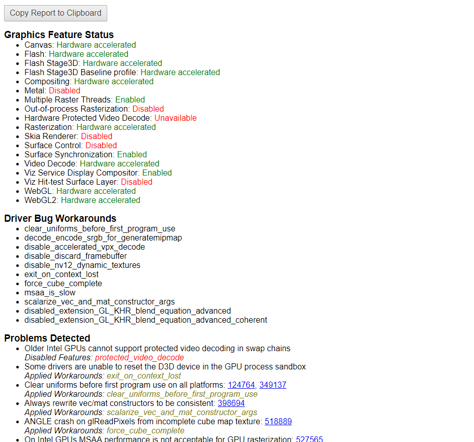
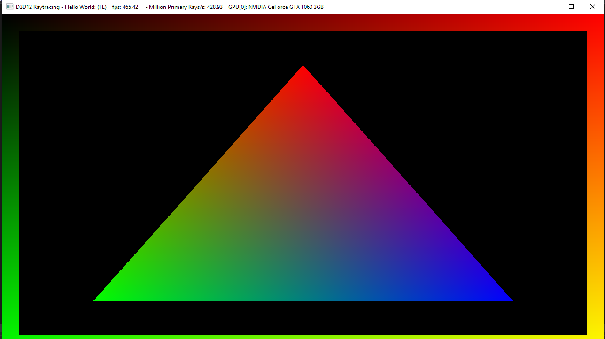
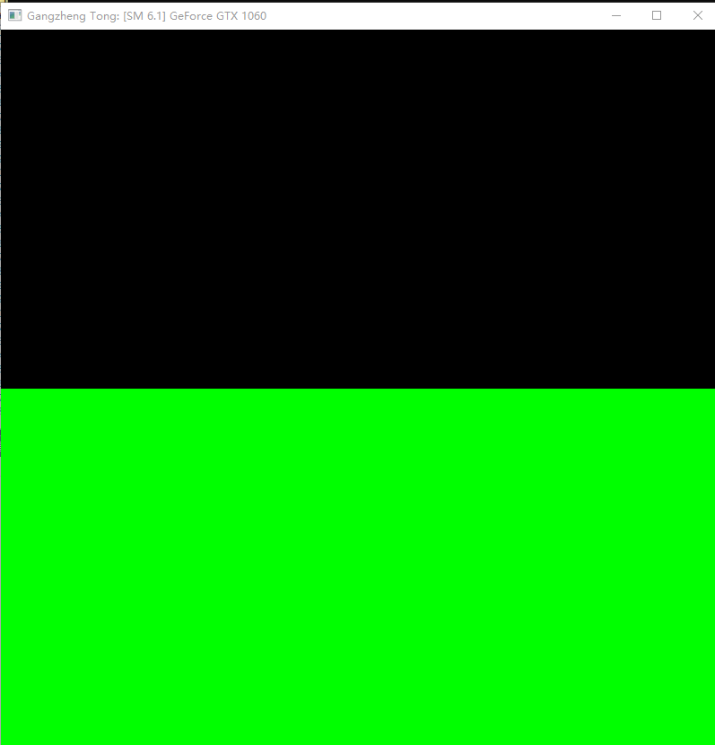
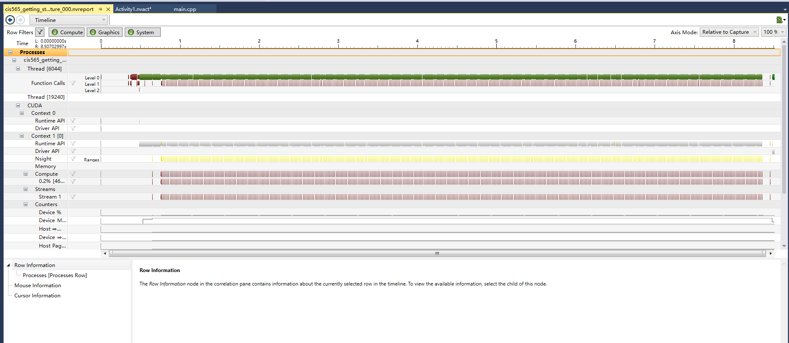
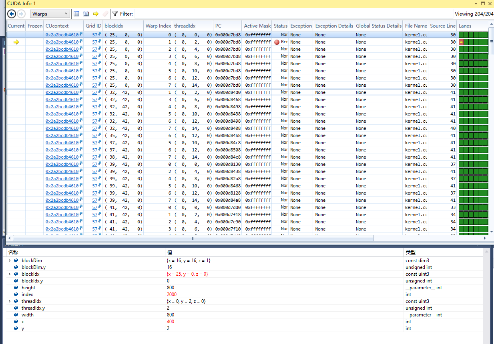

Project 0 Getting Started
====================

**University of Pennsylvania, CIS 565: GPU Programming and Architecture, Project 0**

* Gangzheng Tong
  * www.gtong.me
  * www.linkedin.com/in/gztong
* Tested on: (TODO) Windows 10 Pro 64-bit, E3-1225 @ 3.3GHz 16GB, GTX 1060 3GB, personal computer

### Gangzheng Tong

Include screenshots, analysis, etc. (Remember, this is public, so don't put
anything here that you don't want to share with the world.)

